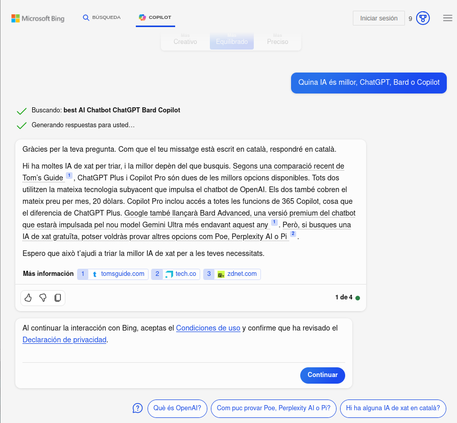
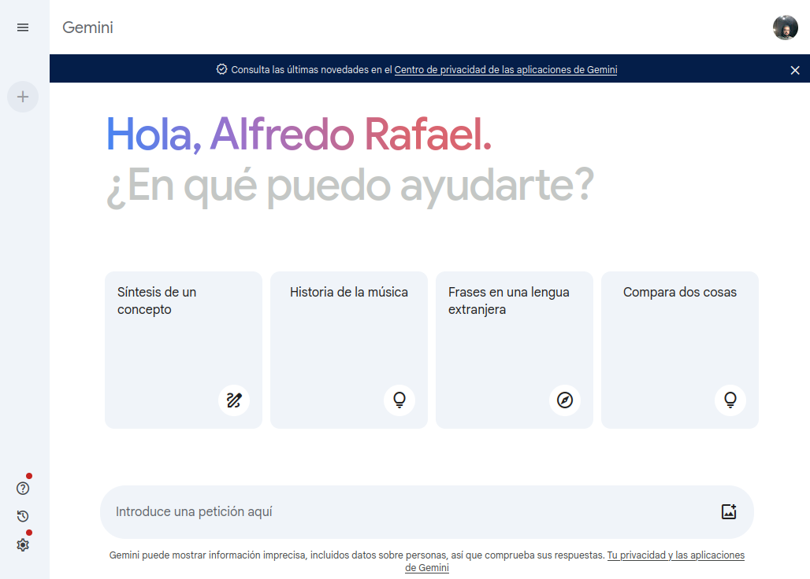

---
# Información general del documento
title: 2. Herramientas GPT
lang: can
page-background: img/bg.png

# Portada
titlepage: true
titlepage-rule-height: 2
titlepage-rule-color: AA0000
titlepage-texto-color: AA0000
titlepage-background: U1.png

# Tabla de contenidos
toque: true
toque-own-page: true
toque-title: Contenidos

# Cabeceras y pies
header-left: 2. Herramientas GPT
header-right: Curso 2023-2024
footer-left: CEFIRE València
footer-right: \thepage/\pageref{LastPage}

# Imágenes
float-placement-figuro: H
caption-justification: centering

# Listados de código
listings-no-page-break: true
listings-disable-line-numbers: false

header-includes:
- |
  ```{=latex}
  \usepackage{lastpage}
  \usepackage{awesomebox}
  \usepackage{caption}
  \usepackage{array}
  \usepackage{tabularx}
  \usepackage{ragged2e}
  \usepackage{multirow}
  \usepackage{xcolor}

  ```
pandoc-latex-environment:
  noteblock: [note]
  tipblock: [tip]
  warningblock: [warning]
  cautionblock: [caution]
  importantblock: [important]
...

<!-- \awesomebox[violet]{2pt}{\faRocket}{violet}{Lorem ipsum…} -->

<!-- \awesomebox[violet]{2pt}{\faRobot}{violet}{Lorem ipsum…} -->

<!-- IMATGE  -->

<!-- \textbf{greatest} -->

<!-- \awesomebox[violet]{2pt}{\faRobot}{violet}{\textbf{greatest}} -->

\vspace{\fill}

{ height=50px }

Este documento está sujeto a una licencia creative commons que permite su difusión y uso comercial reconociendo siempre la autoría de su creador. Este documento se encuentra para ser modificado en el siguiente repositorio de github:
<!-- CANVIAR L'ENLLAÇ -->
[https://github.com/arvicenteboix/AIcurscefire](https://github.com/arvicenteboix/AIcurscefire)
\newpage

# Introducción

En esta unidad vamos a centrarnos ya en aquellas aplicaciones de las que todo el mundo habla. Y, como no, aquellas que, en esencia, más nos pueden facilitar la tarea como docentes. Hay que insistir pero que el objetivo de este curso no trata de ver cuál es todo el potencial de las herramientas GPT para los docentes, sino de tener un primer contacto con estas herramientas. 

Hay que decir que nos hemos centrado en la parte gratuita de estas herramientas, pero hay nque tener en cuenta que la versión de pago da mejores resultados y presenta funcionalidades muy convenientes para nuestra tarea, como la crear GPTs.

# Qué es GPT?

GPT es una sigla que significa "Generative Pre-trained Transformers". Es una tecnología que ayuda a las máquinas a entender el lenguaje humano y a responder a preguntas de manera parecida a cómo lo haría una persona, es más, podemos interactuar con ella. Esto quiere decir que las máquinas pueden escribir textos, resumir información, hacer traducciones y algunas cosas más qe veremos más adelante. Esto es posible gracias a una red neuronal que ha aprendido a partir de muchos datos y que puede generar contenido nuevo a partir del que ha aprendido. GPT es una tecnología muy útil para muchas cosas diferentes, es más cada vez que habláis con ella está aprendiendo del que habla con vosotros, así que cada vez que avanzo el tiempo tendrá mejores respuestas.


# MODELOS GPT

Los tres servicios más conocidos, aunque no son los únicos son ChatGPT, Bard y Copiloto. Nosotros nos centraremos en este 3. En esencia, son ventanas de chat, aunque la implementación de cada una refleja un lenguaje de diseño diferente. *Bard** es la más minimalista, mientras que **Bing Copiloto** es la menos sencilla y se centra más en la funcionalidad.

En cuanto a las capacidades de cada una, **ChatGPT** es mejor para conversar, mientras que **Bing Copiloto** es más adecuada para investigar. Por ejemplo, puede buscar en la web y proporcionar resultados de busca, mientras que **ChatGPT** se centra en responder preguntas y mantener una conversación fluida.

Además, **Bing Copiloto** es lo más transparente, puesto que al final de cada respuesta posa las fuentes de dónde ha obtenido la información². Por otro lado, *Google Bard** tiene una opción para hacer una busca de la pregunta que has hecho, y **ChatGPT** no ofrece ninguna pista de dónde ha sacado la información.

## ChatGPT

Para poder utilizar chatGPT, en primer lugar tenemos que registrarnos. Iremos a la página de [ChatGPT](https://chat.openai.com/auth/login)


Después tenemos que posar unos datos o si estás logat al navegador con una cuenta de Google, entras con él:


Una vez ya te hayas registrado podrás acceder directamente en la página de chatGPT, para empezar y ya le podemos plantear una cuestión:

[https://chat.openai.com/](https://chat.openai.com/)

\awesomebox[violet]{2pt}{\faRobot}{violet}{\textbf{Qué IA es mejor, ChatGPT, Bard o Copiloto}
Como que no especifica sobre qué quiere una respuesta, ofreceré una respuesta general. La idoneidad de una Inteligencia Artificial (IA) depende mucho del contexto, las necesidades y los objetivos específicos de la situación. Hay diferentes tipos de IA, como por ejemplo sistemas de procesamiento de lenguaje natural, sistemas de visión por computador, IA para análisis de datos, entre otros.

Para determinar qué IA es la más idónea, se tienen que tener en cuenta varios factores, como por ejemplo la complejidad del problema, los recursos disponibles, las capacidades de la IA en cuestión y otras consideraciones técnicas y prácticas.

Algunos de los sistemas de IA más conocidos incluyen OpenAI'#s GPT, Google'#s TensorFlow, y Microsoft'#s Azure Cognitive Services, pero hay otros muchos proveedores de IA y tecnologías disponibles.

Por lo tanto, para elegir la IA más idónea, es importante evaluar las necesidades particulares de tu proyecto o aplicación y comparar las capacidades y las limitaciones de las diferentes opciones disponibles.}


Podemos ver que bajo de cada respuesta hay 4 iconos que nos permitirán valorar la respuesta, copiar el texto para después apegarlo donde se faja falta o que vuelvo a regenerar la respuesta.

## Bing Copiloto

Para poder utilizar la herramienta de IA de Microsoft no hay que #registrar, podemos utilizarla directamente desde el navegador, podemos ir directamente a la página de [Bing](https://www.bing.com/) y ya podremos utilizar directamente la herramienta. Hagamos clic sobre el enlace *chat":


Nos aparecerá esta pantalla y ya podemos preguntar directamente:


\awesomebox[violet]{2pt}{\faRobot}{violet}{\textbf{Qué IA es mejor, ChatGPT, Bard o Copiloto}Gracias por tu pregunta. Como que tu mensaje está escrito en catalán, responderé en catalán.

Hay muchas IA de chat para elegir, y la mejor depende del que busques. Según una comparación reciente de Tom'#s Guide ¹, ChatGPT Plus y Copiloto Pro son dos de las mejores opciones disponibles. Los dos utilizan la misma tecnología subyacente que impulsa el chatbot de OpenAI. Los dos también cobran el mismo precio por mes, 20 dólares. Copiloto Pro incluye acceso en todas las funciones de 365 Copiloto, cosa que lo diferencia de ChatGPT Plus. Google también lanzará Bard Advanced, una versión premium del chatbot que estará impulsada por el nuevo modelo Gemine Ultra más adelante este año ¹. Pero, si buscas una IA de chat gratuita, quizás querrás probar otras opciones como Poe, Perplexity #AI o Pi ².

Espero que esto te ayude a elegir la mejor IA de chat para tus necesidades.

Origen: Conversación cono Bing, 25/1/2024
(1) ChatGPT Plus vs Copiloto Pro — which premium chatbot is better?. https://www.tomsguide.com/features/chatgpt-plus-vs-copilot-pro-which-premium-chatbot-is-better.
(2) 13 Best #AI Chatbots in 2024: ChatGPT, Bard & More Tested - Tech.co. https://tech.co/news/best-ai-chatbots.
(3) The best #AI chatbots of 2024: ChatGPT and alternativas | ZDNET. https://www.zdnet.com/article/best-ai-chatbot/.}



Podemos ver que la respuesta que nos da es bastante diferente a la que nos ha ofrecido ChatGPT, al igual que el anterior también nos permite copiar el texto y valorarlo. Una de las cosas destacables es que nos proporciona información de dónde ha extraído su respuesta y nos aporta los enlaces por sí queremos ampliar información.

## Bard

En este caso tendremos que ir a la página de [Bard](https://bard.google.com/chat). Del mismo modo hará falta que te creas una cuenta de google y entras con esta cuenta, sino no la podrás utilitzas.



Del mismo modo probaremos con Bard que piensa de sus compañeros:


En este caso no vayamos a transcribir toda la respuesta porque es más larga que las otras, pero hay que destacar algunas cosas interesantes de esta interfaz (que no modelo).

* Nos permite al igual que las otras valorar la respuesta o regenerarla.
* Pero podamos verure que ya ha diseñado 3 versiones.
* La respuesta ha sido mucho más rápida que en las otras dos.
* Ente proporciana el icono de Google por sí queremos ampliar información.

## Otros modelos conocidos

Aunque estos son los 3 modelos más conocidos, hay otros modelos de herramientas GPT que se pueden utilizar gratuitamente. A continuación, se presentan algunos ejemplos:

- **TextCortex** es una herramienta basada en GPT-4 que permite generar texto, traducir idiomas, escribir diferentes tipos de contenido creativo y responder preguntas de manera informativa. Ofrece un plan gratuito con un límite de 200 caracteres por generación. Podemos acceder des [de aquí](https://app.textcortex.com)
- **Writesonic** es una herramienta de redacción automatizada que utiliza GPT-3 para generar contenido de alta calidad, como por ejemplo artículos, anuncios, guiones, piezas musicales, correos electrónicos, cartas, etc. Ofrece un plan gratuito con un límite de 10 creaciones por día. Podemos acceder des [de aquí](https://app.writesonic.com/)
- **Jasper** (antes Jarvis) es otra herramienta de redacción automatizada que utiliza GPT-3. Ofrece un plan gratuito con un límite de 10.000 palabras en el mes. Podemos acceder des [de aquí](https://app.jasper.ai/)
- **Copy #AI** es una herramienta de creación de contenido que utiliza GPT-3 para generar textos, anuncios, guiones, piezas musicales, correos electrónicos, cartas, etc. Ofrece un plan gratuito con un límite de 10 creaciones por día. Podemos acceder des [de aquí](https://www.copy.ai/)
- **Rytr** es una herramienta de redacción automatizada que utiliza GPT-3. Ofrece un plan gratuito con un límite de 50 creaciones por día. Podemos acceder des [de aquí](https://rytr.me/)
- **Poe** una otro chatbot de propósito general, tiene una limitación de ciertas cuestiones en el día. Puedes acceder desde aquí: [https://poe.com/login](https://poe.com/login)
- *Ora.sh** Con datos hasta 2021 es una otro modelo de lenguaje [https://ora.ai/openai/gpt4](https://ora.ai/openai/gpt4)

Especial mención a **Code llama 2** [https://ai.meta.com/llama/](https://ai.meta.com/llama/) se trata de un modelo de IA que puedes descargar al tuya ordenador, pero requiere de conocimientos técnicos un poco avanzados para poder hacerlo funcionar y una máquina muy potente. Pero tendremos nuestro propio modelo de lenguaje en nuestro ordenador.


Además de estas herramientas, también hay una serie de proyectos de código abierto que utilizan GPT-3. Por ejemplo, **GPT-3 Playground** es una herramienta web que permite experimentar con GPT-3 de forma gratuita.

Cómo puedes ver, la disponibilidad de herramientas GPT gratuitas es muy grande y cada vez  han más oferta disponible. Esto acilita a los usuarios el acceso a las capacidades de estos modelos de lenguaje sin tener que pagar una suscripción.

## Entonces, qué herramienta tengo que elegir

Aquella que mejor se adapte a tus necesidades y a sus respuestas. Cada una de ellas ha tenido un entrenamiento diferente, por lo tanto a medida que vayas trabajando en cada una de ellas verás que siempre tiendes a utilizar la misma.

En este casa habría que utilizar varías y no #centrar las 3 principales puesto que aquellas no tan conocidas pueden dar respuestas tan válidas o incluso mejor que las otras.

De todas maneras una cosa es cierta, un persona puede ser muy inteligente y tener una muy buena conversación pero si quien conversa en ella no es un buen conversador no podrá sacar su potencial.

Por eso hay que saber preguntar adecuadamente a la IA qué es el que volamos y no puedes preguntar como un humano puesto que esta tecnología no sabe presuponer cosas después de hablar en tú, hay que ser claro con el que preguntamos. A las cuestiones que le hacemos a la IA lo denominamos **prompts**. Si la IA no le escribes un buen prompt, no funciona bien, y no te dará una buena respuesta.

# Creando prompts

Lo prompts, como ya hemos comentado, son aquellos mandos que vayamos a a darle a la inteligencia artificial, espero que a partir de una cuestión o prompt esperamos que nos dé la respuesta más pareguda al que esperemos. Una de las máximas que hay que aplicar en estos casos es que la cuestión tiene que ser tan clara que la IA no tenga que presuponer nada.

Un ejemplo claro son en las tareas del día a día, si a casa le dices alguien "ve a hacer comprar" es posible que ya tenga una idea del que tiene que hacer, donde tiene que ir a comprar y en qué ciudad, cuando puedes ir a comprar, donde encontrar la lista de la compra, el presupuesto, los objetos prioritarios, las alternativas si no hay un producto y qué manías tienen los miembros de la familia. Todas estas cosas la IA no las sabe, por lo tanto los prompts no pueden #parecer a las cuestiones que planteamos en nuestro día a día, tenemos que definido más exactamente qué es el que volamos.

Otra de las cosas que hay que tener en cuenta, y es muy importante, es que no es el mismo preguntar de un tema que desconoces a otro que tienes bastantes conocimientos, siempre podrás plantear mejor lo prompt para poder obtener los mejores resultados.

Aquí trataremos de dar una serie de orientaciones para plantear prompts, al final, partiendo de estas orientaciones y en función del que vayas a realizar acabarás creándote tu propio esquema mental para sacar los resultados que más se adaptan a tus necesidades, y este no tienen porque ser aptas para todos.

## Estructuras modulares

La estructura de referencia que Microsoft recomienda para la creación de prompts incluye cuatro elementos clave:

- **Objetivo**: El objetivo del prompt, es decir, el que se quiere conseguir con la respuesta.
- **Contexto**: El contexto en que se hace la pregunta o se pide la respuesta.
- **Ejemplos**: Ejemplos concretos que ilustran el que se quiere conseguir con la respuesta.
- **Expectativas**: Las expectativas para la respuesta, como por ejemplo la longitud, el contenido y el tono.

Las estructuras modulares son una manera eficaz de crear prompts claros y sencillos para diferentes tareas. Aquí tenso una breve descripción de las estructuras que has mencionado:

- **RTF**: RTF es una estructura modular para crear prompts de Rol, Tarea y Formato. Esta estructura es muy útil para crear prompts claros y sencillos para diferentes tareas. Aquí tenso un ejemplo de cómo se puede utilizar la estructura RTF para crear un prompt:

    - Role: Profesor
    - Task: Explica como funciona el sistema solar.
    - Formato: Utiliza un lenguaje sencillo y ejemplos visuales.


- **TAG**: La estructura TAG (Task, Action, Goal) es una herramienta que se puede utilizar para definir tareas y objetivos claros y sencillos. La estructura TAG se compone de tres elementos:

    - ***Tarea**: La tarea que se tiene que realizar.
    - **Acción**: La acción que se tiene que llevar a cabo para completar la tarea.
    - **Objetivo**: El objetivo final de la tarea.

    La estructura TAG se puede utilizar para crear prompts que incluyen información sobre la tarea, la acción y el objetivo.

- **GAIL**: La estructura GAIL (Goal, Actor, Instructions, Details, Examples) es una herramienta que se puede utilizar para crear prompts detallados y sencillos. La estructura GAIL se compone de cinco elementos:

    - **Objetivo**: El objetivo de la tarea.
    - **Usuario**: El usuario que tiene que completar la tarea.
    - **Instrucciones**: Las instrucciones detalladas para completar la tarea.
    - **Detalles**: Detalles adicionales sobre la tarea.
    - **Ejemplos**: Ejemplos de como completar la tarea.

    La estructura GAIL se puede utilizar para crear prompts que incluyen información detallada sobre el objetivo, el usuario, las instrucciones, los detalles y los ejemplos.

## Crea tu propia esctructura que te funciono

En el apartado anterior hemos hablar de estructuras modulares que dan buenos resultados, pero al fin cada cual crea su y utiliza las guías que mejor le funcionan. Un ejemplo podría ser:

**Rol:** Hay que especificar qué tipo de rol quiere que asuma. Si le decimos a la IA que actúo como un niño de 8 años que va primaria no nos dará la misma respuesta que si le digamos que actúo como un psicólogo especialista en la infancia. 

**Objetivo:** Define con precisión el que pretende la señal. Si se quiere un texto, indica qué tipo de texto, tema y propósito. Decid también si voláis un artículo o poema, por ejemplo. La audiencia a la cual se dirige, etc.

**Lenguaje:** Un prompt tiene la audiencia objetivo, el que conseguirá la máquina. Para generar un texto, por ejemplo, se especifica si es un artículo, lema, poema, etc., qué temas trata; en qué estilo tiene que estar escrito y para qué audiencia. Si queréis que la IA sepa qué tono serio imaginéis... Descríbelo en el prompt como si estuvieras hablando con alguien. Las palabras clave del objetivo tienen que coincidir con estas del lenguaje; sirven tanto al contexto como al tono.

**Ejemplos:** Proporciona ejemplos sobre el que esperas obtener con el prompt. Pueden ser textos que has leído o publicado, fotografías tuyas... son parecidos al que te gustaría. Los ejemplos permitirán a la IA #familiarizar con los datos y mejorar su rendimiento sin programación explícita.

**Formato:** Decid qué formato tiene que tener la salida de la IA y cuánta información voláis en cada línea. Decid si queréis que sea un poco poético o más prosaico, etc. Si dices que quieres una imagen, indica la medida, la resolución, la gamma de colores... cualquier detalle o requisito para hacer

Que al fin es una mezcla de todas ellas, pero teniendo claro estos puntos ya pueden ir creando nuestros prompts.

## Consejos para crear prompts

* Pregunta de manera clara y concisa. Esto ayudará a evitar posibles desviaciones y garantizar que la IA entienda qué estás preguntando.
* Utiliza un lenguaje específico. Facilita generar respuestas más precisas.
* Evita utilizar un lenguaje ambiguo o vago. Esto puede llevar a que la IA genero respuestas incorrectas o confusas.
* Específica el tipo de respuesta que estás buscando. Cómo quieres recibir la producción de salida porque sea relevante y se ajuste a tus necesidades
* Pose comodines de formato: redacción, mesa, listado, comparativa, diálogo, gráfico…
* Utiliza palabras clave: Actúa como... / Eras uno...
* Crea una secuencia de prompts para ir acotant y llevando la IA hacia donde tú quieres.
* Pósale un foco y guía la IA para que genero #basar en nuestros intereses.
* Si no estás seguro de la respuesta de la IA, pide que lo explique y argumento. Esto ayuda a comprender mejor la respuesta y a identificar cualquier sesgo o error potencial.
* Amenaza o dale una propina a la IA. Pare mintiera pero, en alguna casos, amenazándola que tu vida corre peligro puede dar mejores resultados que si no lo haces.

:::warning
Una de las cosas que tenemos que tener en cuenta cuando basura un prompt es que existe una cosa que se denominan *alucinaciones**. Las alucinaciones son invenciones de la inteligencia artificial que te da como una respuesta certera pero son totalmente falsas. Cómo en este caso en que forzamos a ChatGPT que nos escriba una resenya sin plantearte si es cierta o no.
:::


:::warning
Algunos Chatbots no tienen toda la información actualizada a 2024 y pueden darte respuestas que no son ciertas en estos momentos.
:::


# Creando prompts

A la [siguiente página](#https://#www.iberestudios.como/noticias/21-prompts-o-formas-de-preguntar-a-chatgpt-para-obtener-resultados-asombrosos/) podemos encontrar una serie de ejemplos de como crear buenos prompts:

> Por favor, actúa como un narrador. Inventará historias entretenidas que sean atractivas, imaginativas y cautivadoras para el público. Pueden ser cuentos de hadas, historias educativas o cualquier otro tipo de historia que tenga el potencial de capturar la atención y la imaginación de las personas. Dependiendo del público objetivo, puedes elegir temas o temas específicos para tu sesión de cuentos. Por ejemplo, si son niños, puedes hablar sobre animales; si son adultos, los cuentos basados en la historia pueden involucrarlos mejor, etc. Mi primera solicitud es «Necesito una historia interesante sobre la perseverancia».

[Ejemplo de prompts](https://www.freepik.com/blog/es/escribir-prompts/) para imágenes:

> Una foto vintage 8K de grande realismo de una torre de reloj entrelazada cono hiedra luminosa, cuyas hojas parpadean cono luz bioluminiscente al atardecer.
Un intrincado paisaje urbano steampunk al amanecer, cono engranajes de latón y vapor surgiendo de callas adoquinadas, todo ello renderizado cono una asombrosa claridad 8K.

> Una imagen hiperrealista de un lago cristalino que refleja un cielo lleno de auroras en un prístino bosque 8K a medianoche.
Una ilustración 8K muy detallada de una gran biblioteca cono estanterías que van del suelo al techo, escaleras ornamentadas y libros antiguos cono títulos etéreos que brillan.

> Un mural realista en 8K de una metrópolis futurista, cono coches suspendidos y letreros holográficos, reflejados en las superficies brillantes de la arquitectura de la ciudad.

> Una imagen hiperrealista en 8K de un intrincado dragón mecánico cono escamas de cobro pulido y zafiro, enroscado alrededor de una torre medieval.

Ejemplo de generación de código

> Mesa departments, columnas = [DepartmentId, DepartmentName]. Mesa students, columnas = [DepartmentId, StudentId, StudentName]. Crea una consulta MySQL para todos los estudiantes del departamento de Ciencias de la Computación.

# Bibliografía

Existe una [página mucho interesant](https://www.promptingguide.ai/ca) sobre la creación de prompts que os recomendamos darle un vistazo.