---
# Información general del documento
title: 3. Creación multimedia con IA
lang: can
page-background: img/bg.png

# Portada
titlepage: true
titlepage-rule-height: 2
titlepage-rule-color: AA0000
titlepage-texto-color: AA0000
titlepage-background: U3.png

# Tabla de contenidos
toque: true
toque-own-page: true
toque-title: Contenidos

# Cabeceras y pies
header-left: 3. Creación multimedia con IA
header-right: Curso 2023-2024
footer-left: CEFIRE València
footer-right: \thepage/\pageref{LastPage}

# Imágenes
float-placement-figuro: H
caption-justification: centering

# Listados de código
listings-no-page-break: true
listings-disable-line-numbers: false

header-includes:
- |
  ```{=latex}
  \usepackage{lastpage}
  \usepackage{awesomebox}
  \usepackage{caption}
  \usepackage{array}
  \usepackage{tabularx}
  \usepackage{ragged2e}
  \usepackage{multirow}
  \usepackage{xcolor}

  ```
pandoc-latex-environment:
  noteblock: [note]
  tipblock: [tip]
  warningblock: [warning]
  cautionblock: [caution]
  importantblock: [important]
...

<!-- \awesomebox[violet]{2pt}{\faRocket}{violet}{Lorem ipsum…} -->

<!-- \awesomebox[violet]{2pt}{\faRobot}{violet}{Lorem ipsum…} -->

<!-- IMATGE { width=10cm } -->

<!-- \textbf{greatest} -->

<!-- \awesomebox[violet]{2pt}{\faRobot}{violet}{\textbf{greatest}} -->

\vspace{\fill}

{ width=10cm }{ height=50px }

Este documento está sujeto a una licencia creative commons que permite su difusión y uso comercial reconociendo siempre la autoría de su creador. Este documento se encuentra para ser modificado en el siguiente repositorio de github:
<!-- CANVIAR L'ENLLAÇ -->
[https://github.com/arvicenteboix/AIcurscefire](https://github.com/arvicenteboix/AIcurscefire)
\newpage


# Introducción

Hasta ahora hemos visto algunas herramientas GPT, pero en la red podemos encontrar un montón de aplicaciones que hacen uso de la inteligencia artificial para crear casi cualquier producto multimedia. En este módulo os plantearemos algunas herramientas que os pueden ser de utilidad en vuestro día a día. Pero como bien sabréis, son unas cuántas de ejemplo. Estoy seguro que vosotros  conoceréis muchas más y que seràn tan útiles como las planteadas aquí.

:::warning
Es recomendable que os creéis un correo aleatorio para poder #inscribir uno probar así todas las herramientas sin necesidad de tener que mujer vuestro correo personal. Si alguna os interesa ya mucho, di que podrieu utilizar vuestro correo para estar informado de las novedades.
:::

# Buscadores que utilizen inteligencia artifical

Ya hemos comentado al módulo 1 la diferencia entre algoritmo y red neuronal, básicamente un algoritmo es una secuencia lógica de pasos que permite solucionar un problema mediante operaciones matemáticas no-ambiguas, mientras que una red neuronal es un sistema que puede aprender y #modificar a sí mismo. Los buscadores más conocidos, a pesar de que poco a poco van introduciendo redes neuronales están basados principalmente en algoritmos de busca. Pero existen otros tipos de buscadores que nos pueden facilitar más nuestra busca por Internet. Aquí os damos dos ejemplos:

## Perplexity

Perplexity tiene un entorno similar a los bots conversacionales pero este está centrado en la busca de información y siempre partiendo de unas fuentes, que bien buscará él o podrás proporcionar tú. Podemos acceder desde aquí:

[http://www.perplexity.ai](http://www.perplexity.ai)

:::info
Como en todas las plataformas habrá que acceder con una cuenta de google o hacer el registro en la página.
:::

Aquí tenéis un ejemplo que ilustra un poco el que estamos comentando. Si le preguntamos a perplexity:

\awesomebox[violet]{2pt}{\faRobot}{violet}{\textbf{Qué centro de la comunidad valenciana ha sacado las mejores notas en las pruebas EBAU al 2023}
Podemos ver que las respuestas que nos da difieren de si le doy un contexto o no} 

{ width=10cm }

:::caution
Fijaos que él coge unas referencias que él considera óptimas, pero no son las ideales.
:::

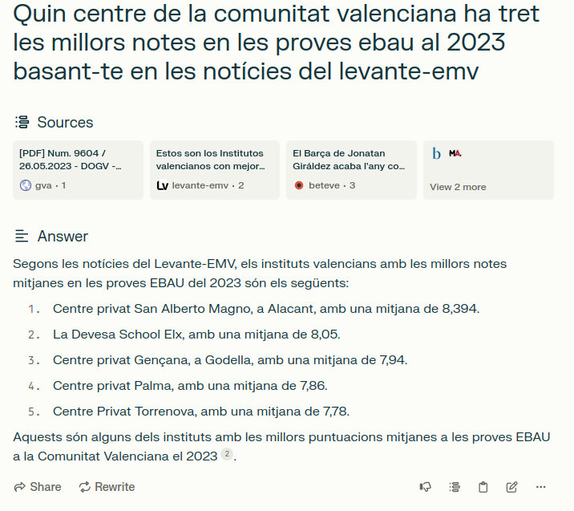{ width=10cm }

:::importando
Fijaos que las respuestas dadas no son una verdad absoluta, le hemos dado un contexto. En este caso nos da unos resultados #basar en unas medias numéricas que es el que ha considerado el diario como mejor o peor. Hace falta siempre tener una capacidad de valoración para saber el tipo de respuesta que tenemos.
:::

Si basura una cuestión más general, entenderemos porque esta herramienta está orientada más en la busca de información:

{ width=10cm }

Probablemente otro chatbot como chatgpt ya nos habría dado algún ejemplo sobre alguna receta de cocina.

:::tip
Como veáis cada IA tiene un propósito específico. Por eso es importante en que no os quedáis solo en una y que vayáis investigando diferentes versiones de todas ellas. También dependerás de las necesidades que tengan en cada momento para utilizar una u otra.
:::

## You

Podemos encontrar el buscador you en la página: 

[https://you.com/](https://you.com/)

Al igual que Perplexity, you también es una IA centrada en la busca de información, las respuestas que nos da son más naturales pero no nos da las referencias de dónde ha extraído la información. Fijémonos qué respuesta nos da a la misma cuestión plateada a perplexity:

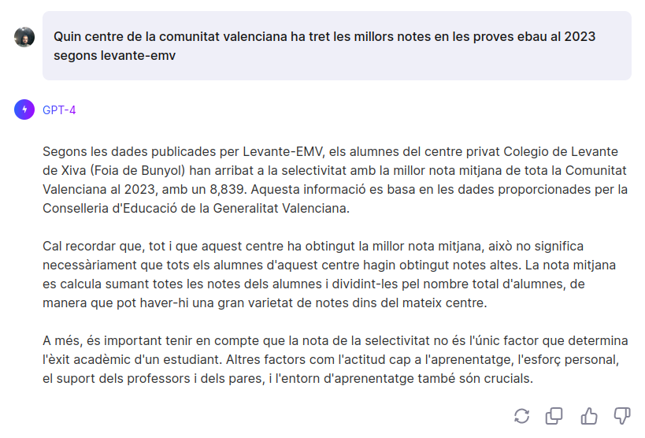{ width=10cm }

:::note
Si analizamos la respuesta veremos que nos da un resultado bastante diferente del que esperábamos, por eso es importante leer la respuesta puesto que podemos ver que nos dice claramente han llegado a la selectividad con la mejor nota mediana de toda la Comunidad Valenciana al 2023*. Y no está hablando concretamente de la nota mediana después sino de antes.
:::

# Creación de imágenes y videos

## Flexclip

Se trata de una herramienta para crear y editar videos, esta presenta una parte donde puedes generar videos a partir de texto. Hay que ser muy específicos con el que se desea puesto que los resultados no son nunca los que uno está pensando. Es un herramienta. Podemos acceder desde aquí:

[https://www.flexclip.com](https://www.flexclip.com)

Para crear un video a partir de texto tenemos que ir a la herramienta AI Video Generator:

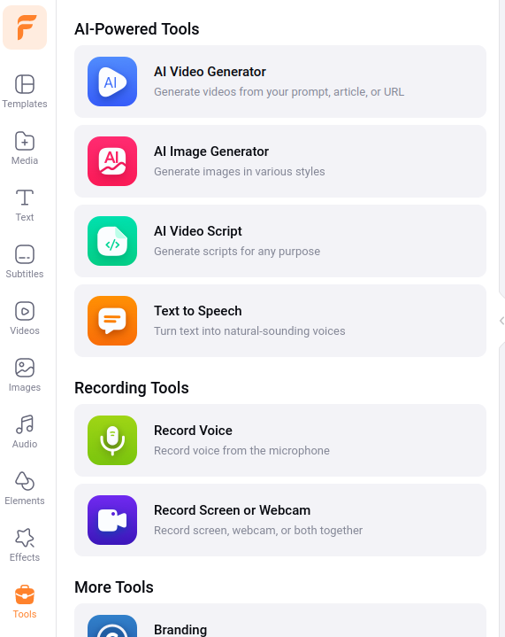{ width=10cm }

Y escribimos un texto:

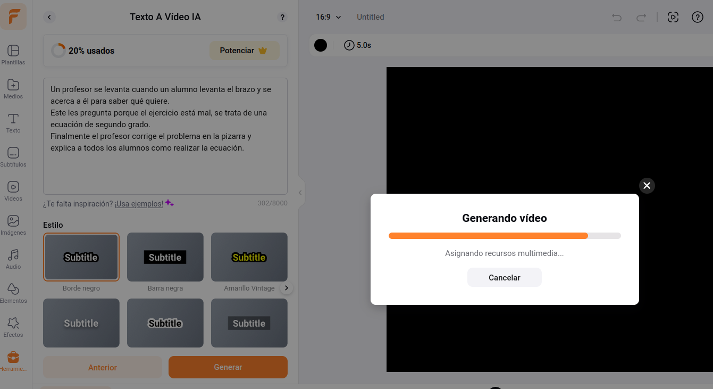{ width=10cm }

:::note
Se trata de una herramienta de pago como case todas las que vayamos a ver, estas nos permiten crear una serie de archivos multimedia en el día. Así que hay que tener en cuenta estas limitaciones. Flexclip, también otros herramientas que pueden resultar interesante como la generación de imágenes además de ser un editor de video online.
:::

## Deepai

Podemos acceder a deepai desde aquí: [https://deepai.org](https://deepai.org). Se trata de un generador de imágenes. Podemos ver que como todas las IA hay que dar un contexto más ancho para tener un resultado más deseado

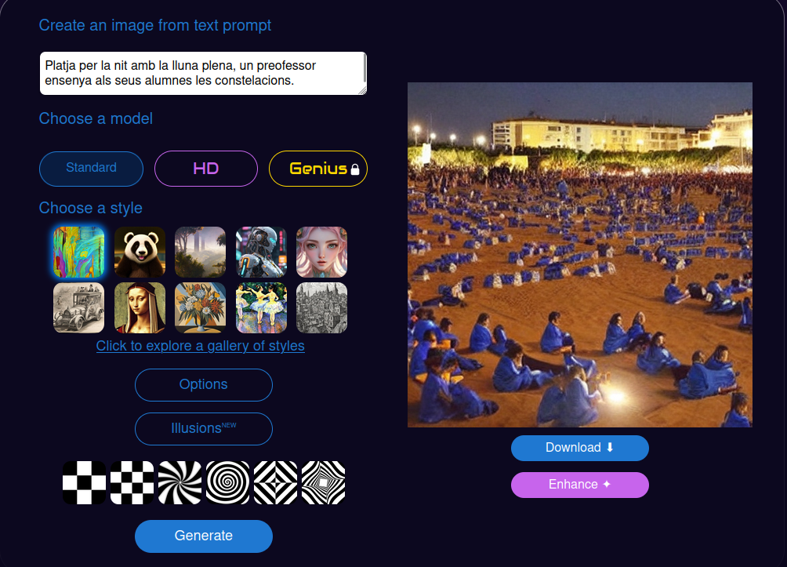{ width=10cm }

:::caution
Nosotros estamos planteando un prompt en valenciano, los mejores resultado siempre serán aquellos que expresamos en inglés. Generar imágenes a partir de IA es un tanto más complexe, siempre podemos modificar el prompt para ir buscando el resultado esperado. Dos cosas que tenéis que tener en cuenta cuando creáis prompts en imagen es que la primera frase es más importante que la última. Fijaos cómo yo quiero que aparezcan los dos alumnos y cambio el prompt para insistirle.
Recordáis que las órdenes que reb la inteligencia artificial tienen que ser claras y directo. Olvidémonos de la educación, no es necesaria!
:::

{ width=10cm }

Esta herramienta permite crear tantas imágenes como vullguen y es bastante útil si te adaptas a sus gustos[^1]

[^1]: cuando hablamos de gustos hablamos de la manera que está entrenada la IA.


## Canva

Canva es una herramienta que muchos utilizamos para generar nuestras creaciones. En el apartado de Apps podemos encontrar muchas herramientas que hacen uso de la IA para generar imágenes. Para acceder a todas estas herramientas vayamos a Apps al menú derecho de Canva cuando estamos creando una imagen.

{ width=10cm }

:::warning
Como casi todas las herramientas de IA para generar imágenes, estas tienen usos limitados, algunas  de las herramientas de Canva te permete crear 25 imágenes en el mes por ejemplo.
::: 

### Animo Style

Con esta App de Canva puedes crear imágenes animo. Os presentamos un ejemplo.

\awesomebox[violet]{2pt}{\faRobot}{violet}{\textbf{Genera una profesora con un libro en la mano.
Genera un profesor enfadado con uno reglo numerado en la mano}}

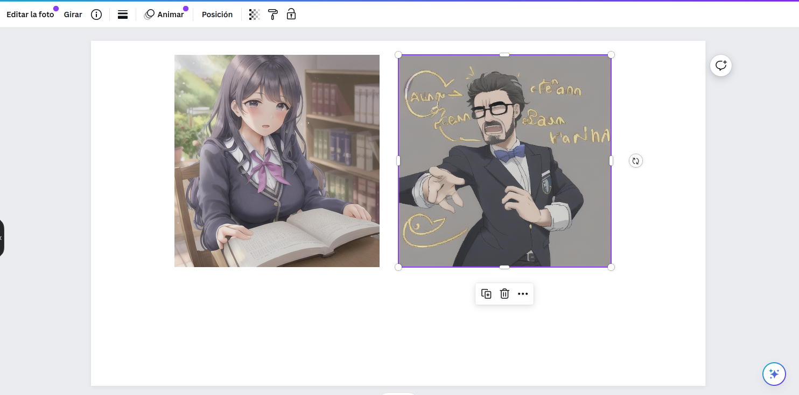{ width=10cm }

### DALL-E

La tecnología DALL-E nos permite crear imágenes a partir de texto. A Canva hay una aplicación con ese nombre limitada a la creación de 25 imágenes en el mes.

\awesomebox[violet]{2pt}{\faRobot}{violet}{\textbf{Profesor enseñando a dos alumnos en la playa por la noche las constelaciones}}

{ width=10cm }

### D-ID AI Presenter

Podemos generar audio para las presentaciones pero podemos añadir una persona que hablo mientras se hace la presentación. Se tiene que conectar a plataforma externa y solo permite la creación de 5 minutos.

{ width=10cm }

 han muchísimas App más dentro de Canva que utilizan la IA para facilitarnos la tarea.


## Leonardo

Podem acceder a Leonardo desde la siguiente dirección: [https://app.leonardo.ai/](https://app.leonardo.ai/).basta Se trata de otra aplicación para crear imágenes que presenta unas funcionalidades bastante interesantes como por ejemplo Image generation, que es la generación de imágenes a partir de texto y Realtime Canva.

{ width=10cm }

La funcionalidad de generación de imágenes es bastante interesante, pero la de realtime Canva va a generarnos una imagen a partir de un dibujo que creamos, podemos escanearlo y subirlo o simplemente dibujarlo para que en faja una interpretación. Se trata de un modelo que generará representaciones artísticas a partir de un concepto más sencillo. Irá generándonos la imagen a partir del dibujo que vamos tirando:

{ width=10cm }

Fijáis-se que nos permite interactuar tanto en las indicaciones que le damos como texto como el que vayamos dibujando, de este modo podemos obtener al una imagen más ajustada al que buscamos.

:::noto
Está bastando optimizada para sacar retratos, así que no os extraño si siempre os saca imágenes de personas de primer plano.
:::

una herramienta parecida a esta la tenemos con [https://www.freepik.com/pikaso#](https://www.freepik.com/pikaso#)

## Wepik

Es una herramienta con el mismo propósito que el anterior pero que también funciona por créditos y te permite generar unas 8 imágenes en el mes. 

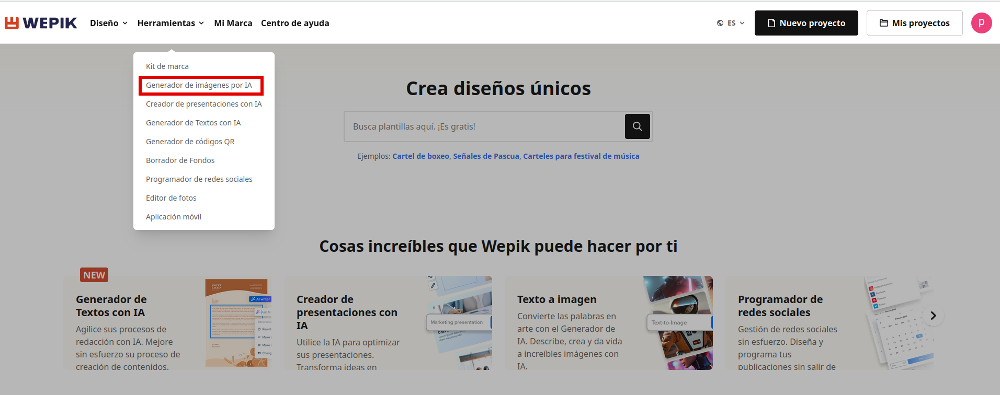  

Aquí tendríamos un ejemplo de la herramienta de generación de imágenes con wepik. 

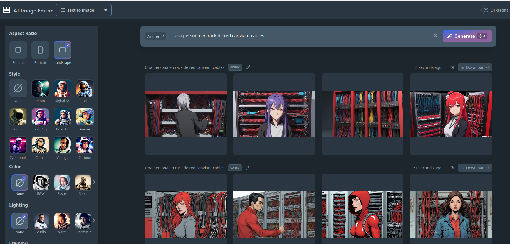

## Bing Copiloto

Hemos estado hablando hasta ahora de Bing Copiloto cono a modelo de lenguaje pero este también puerta incorporada la tecnología DALL-E y podemos generar imágenes desde el mismo Chat de Bing copiloto. Este te lleva a la página [https://www.bing.com/images/create?](https://www.bing.com/images/create?) para que te das de alta y ya puedes crear imágenes. Es recomendable tener una cuenta de Outlook para #dar de alta.

\awesomebox[violet]{2pt}{\faRobot}{violet}{\textbf{Generamos una imagen animo de una persona ingeniera que está ante un rack de red y está quitando un cable de un switch}}

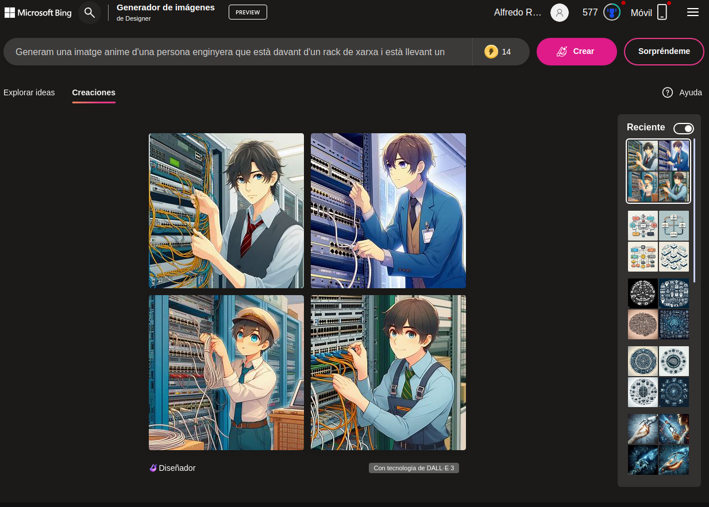

## Qué escollisc

OpenAI (ChatGPT) y Bardo también tienen la tecnología implementada a sus chats, aunque OpenAI es de pago, pero la tendencia es que cada vez más y más plataformas implementan este sistemas de generación de imágenes, los resultados de algunos de ellos pueden ser mejor que los otros siempre dependen de tu manera de generar el prompt.

:::caution
La IA no ha venido para creárnoslo todo sino que nosotros tenemos que saber que preguntamos y como podemos orientarla para sacar los resultados esperados
:::

Obviamente  han otras muchas como:

* [OpenAI](https://openai.com/dall-e-2/): De pago
* [Lexica](https://lexica.arte/)
* [lipDrop](https://clipdrop.co)
 
 # Aplicaciones para dar a conocer la IA en la escuela

 han muchísimas herramientas que nos permiten ver las posibilidades de la inteligencia articial y acercarla a nuestros alumnos. Tal vez se quedamos con las herramientas GPT, pero  han otras muchas posibilidades.

## Replicate

Replicate es una plataforma que te permite utilizar la suya APIO[^2] para lles tuyas aplicaciones (evidentemente con un coste), te da diferentes modelos de ejemplos, para reconocimiento de imágenes, estilizarlas, crear imágenes más realistas, pero introduce conceptos muy interesantes como el de *negative prompt* que es aquello que no queremos que aparezca en nuestra creación.

[^2]: Una APIO es una abreviatura de Interfaz de Programación de Aplicaciones. Es un conjunto de definiciones y protocolos que se utilizan para diseñar e integrar el software de las aplicaciones

Podemos ir a la página de replicate aquí [https://replicate.com](https://replicate.com), pero podemos trastear en uno de los modelos como por ejemplo este:

[https://replicate.com/rossjillian/controlnet](https://replicate.com/rossjillian/controlnet)

Este modelo nos permite reconocer fotografías a partir de un esbozo creado por nosotros y crear uno  más estilizado, nos permite modificar diferentes parámetros para ver el resultado.

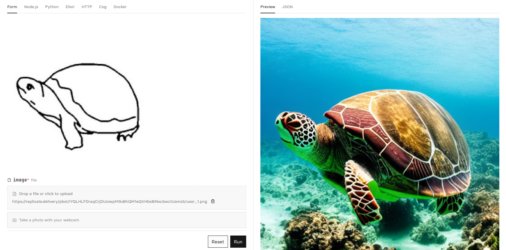

:::caution
El modelo de ejemplo es bastante rápido, pero los otros modelo de ejemplo pueden tardar mucho de tiempo al realizar el que estamos pidiendo. Aun así es una herramienta para entender diferentes conceptos nuevos de la IA, desde los más simples hasta los más avanzados. Si lo utilizáis muchos también os dirá que habéis llegado al límite, pero si cambiáis de navegador podéis continuar, también podáis borrar los datos del navegador para continuar.
:::


## Animated Drawings

Esta plataforma está orientada más a infantil y primaria, y nos permite animar dibujos sencillos que realizamos con nuestros alumnos. El enlace para poder acceder es [https://sketch.metademolab.com/](https://sketch.metademolab.com/)

Nosotros hemos creado la siguiente imagen que pujem al modelo para poder comprobar los resultados:

{ width=5cm }

Nos permite así mismo [compartir](https://sketch.metademolab.com/share/f007a72f87b24dbd9be917d63215cf79/walk_sway) nuestras creaciones.

{ width=10cm }

## Teachablemachine

Esta herramienta, como ya hemos comentado al módulo 1, nos permite entrenar a pequeña escala nuestro modelo de inteligencia artifial para un propósito, por ejemplo el de reconocer objetos, sonidos o posturas. Solo nos hace falta una webcam para hacerlo. Podemos acceder a la plataforma desde aquí: [https://teachablemachine.withgoogle.com/](https://teachablemachine.withgoogle.com/)

{ width=10cm }

Y creamos nuestro primero proyecte

{ width=10cm }

Nosotros hemos preparado un modelo para distinguir entre un bolígragf y unas tijeras, hemos yendo subiendo imágenes de cada uno.

{ width=10cm }

Este modelo lo podemos exportar y lo podemos compartir. Obviamente el modelo que he creado no es demasiado interesante, pero potd dedicarte a entrenar mejores modelos con muchas fotografías, de objetos de la clase y crear tu propio reconocedor de de objetos. Podéis descargar el modelo de de aquí: [https://teachablemachine.withgoogle.com/models/9oqm8e4an/](https://teachablemachine.withgoogle.com/models/9oqm8e4an/)

# inteligencia artificial vs inteligencia artificial

## GPTzero 

Se trata de una herramienta bastante interesante que nos permitirá saber si un texto está generado por inteligencia artificial. Tenemos el enlace aquí [https://gptzero.me/](https://gptzero.me/). Si extraigamos un texto de cualquier periódico conocido y lo pasamos por aqué podemos ver el resultado:


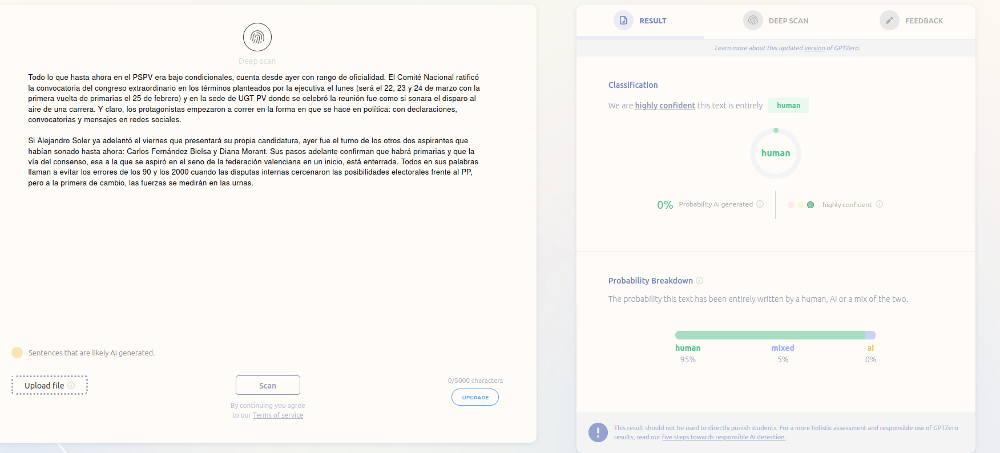

De todas maneras no siempre te saca la realidad y, obviamente, existe [https://www.humanizeaitext.org/](https://www.humanizeaitext.org/) o Quillbot, que sirve para humanizar mś el texto generado por una IA para que resulto menos "artificial"

## Quillbot

Es otra herramienta que nos permite modificar el texto para que parega menos de una IA o simplemente un texto que tengamos y vullguem expresar de otra manera. [https://quillbot.com/](https://quillbot.com/)

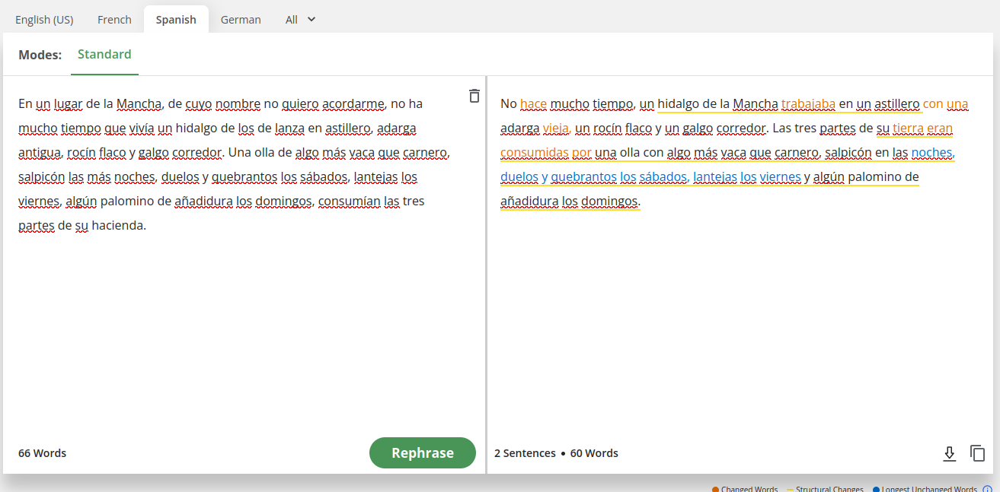

Tenemos otros ferramenntes para humanizar texto que harán más difícil detectar si el texto ha sido creado por una IA o no, recordáis que siempre hay que revisar el material general puesto que pueden aparecer *alucionacions* o incluso cambiar el sentido del texto, como hemos podido ver. Algunos ejemplos son

* **Undetectable AI** [https://undetectable.ai/](https://undetectable.ai/)
* **gpt4detector** [https://gpt4detector.ai](https://gpt4detector.ai)
* **Trinka** [https://www.trinka.ai/es/](https://www.trinka.ai/es/)

# Creación de audio y video

## Studio

A pesar de que también funciona con créditos y permite un límite de creaciones en el mes, se trata de una ferrramenta muy potente. Nos permite crear presentaciones bastante natural con un avatar o una imagen nuestra diciendo el que escribimos.

{ width=10cm }

Podemos acceder a la herramienta desde aquí: [https://studio.d-id.com/editor](https://studio.d-id.com/editor)

:::warning
No pensáis que podéis subir la fotografía de un famoso para que diga el que nosotros vullguen, la paltaforma lo detecta y no te deja.
:::

[Synthesia](https://www.synthesia.io/), es otra herramienta que nos permitirá igualmente crear presentaciones a partir de un texto, el funcionamiento es muy parecido a Studio.

[HeyGen](https://www.heygen.com/) igualmente nos permite crear presentaciones a partir de texto.

## Rask

Se trata de una herramienta que nos permite traduïr un video, nosotros hemos cogido un video de [Eugenio](https://www.youtube.com/shorts/6xq3ay9svha) para sentirlo hablando inglés 

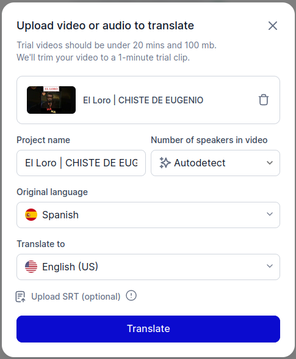{ width=10cm }

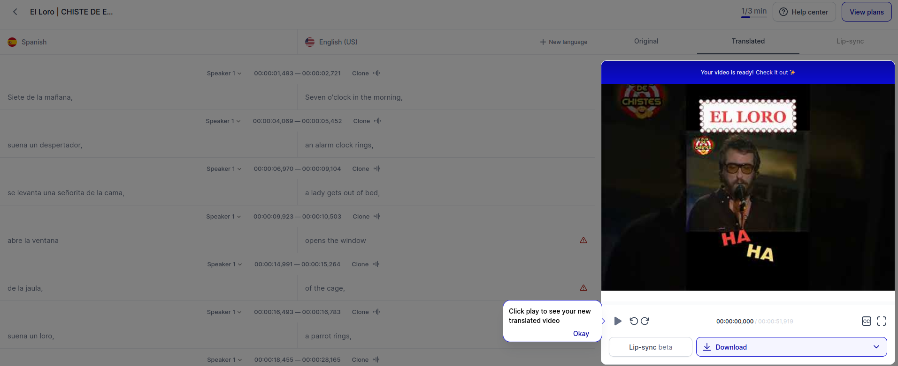{ width=10cm }

Bien es verdad que el resultado es bastante sorprendente.

## Opusclip

Es una herramienta que nos muestra las virtuds y las faltas de la IA, nos permite subir un video y hacernos una explicación resumida del video. En este caso subimos un video de un chiste pero no se capaz de detectar la ironía o las gracias (aunque sean muy malos). Y se lo toma como un video serio. Además le posa suntítols y lo hace de una manera bastante acertada tratar de Chiquito de la calzada. Podemos ver los resultado:

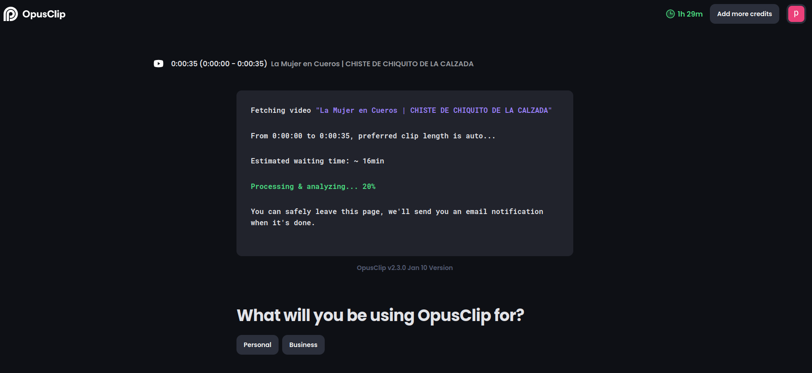{ width=10cm }

{ width=10cm }

Podemos encontrar la herramienta [aquí](https://www.opus.pro/).

Una ferrameta similar es [https://www.you-tldr.com/](https://www.you-tldr.com/), pero esta está especializada en videos de youtube.

## ElevenLabs

Esta herramienta igualmente nos permite convertir texto a audio o un audio a otro audio dándole diferentes entonaciones u otra voz. 

{ width=10cm }

Podemos acceder a la plataforma des [de aquí](https://elevenlabs.io/).

El mismo podemos encontrar a la plataforma [https://www.happyscribe.com/](https://www.happyscribe.com/).

## Otras aplicaciones multimedia de interés

Existen otras aplicaciones que paga la pena nombrar:

- Albus en [https://albus.org/](https://albus.org/) es una herramienta impulsada por IA que compila una base de conocimientos completa de Google Drive, Notion, Jira, HubSpot y 100 aplicaciones más para responder las preguntas de los empleados.
- GitMind en [https://gitmind.com/es/](https://gitmind.com/es/) es una aplicación gratuita de mapas mentales y lluvia de ideas impulsada por IA.
- Decktopus en [https://www.decktopus.com/](https://www.decktopus.com/) es una plataforma de presentación impulsada por IA que ofrece una amplia gamma de temas, fuentes y colores.
- Opus Clip en [https://www.opus.pro/](https://www.opus.pro/) es una herramienta de creación de clips cortos impulsada por IA que transforma videos largos en clips cortos y virales optimizados para varias plataformas de redes sociales.
- Tome en [https://beta.tome.app/](https://beta.tome.app/) es una herramienta de creación de contenido impulsada por IA que ayuda a crear contenido de blog, correos electrónicos y redes sociales.
- SteveAI en [https://www.steve.ai/](https://www.steve.ai/) es una herramienta de creación de contenido impulsada por IA que ayuda a crear contenido de blog, correos electrónicos y redes sociales.
- Gama en [https://gamma.app/](https://gamma.app/) es una herramienta de creación de contenido impulsada por IA que ayuda a crear contenido de blog, correos electrónicos y redes sociales.
- Mixo en [https://www.mixo.io/](https://www.mixo.io/) es una herramienta de creación de contenido impulsada por IA que ayuda a crear contenido de blog, correos electrónicos y redes sociales.
- Microsoft Designer en [https://designer.microsoft.com/](https://designer.microsoft.com/) es una herramienta de diseño gráfico impulsada por IA que ayuda a crear diseños profesionales.
- SkyBox en [https://skybox.blockadelabs.com/](https://skybox.blockadelabs.com/) es una herramienta de creación de contenido impulsada por IA que ayuda a crear contenido de blog, correos electrónicos y redes sociales.


# Generación de materiales didácticos

Las siguientes herramientas nos permiten crear materiales de manera rápida y sencilla ya preparados para publicar. 

:::warning
Hay que tener en cuenta que los materiales que te genera están basados en otros materiales que tiene como referècnia la IA. Y pueden ser o no adecuados al que tú esperas, todo aquello que cree es necesario revisarlo.
:::

## Mindsmith

[Mindsmith](https://www.mindsmith.ai/) es una de las plataformas existentes para crear materiales a modo de presentación:

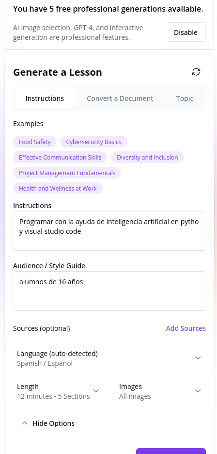{ width=10cm }

Le damos un prompt para que nos genero unos materiales generales. Hay que tener en cuenta todo aquello que hemos visto sobre prompts, cuando más detallado sea lo prompt mejores resultados obtendremos. Además te genera un cuestionario sobre la unidad creada. Os dejamos una unidad de ejemplo creada con Mindsmith:

[https://app.mindsmith.ai/learn/clrxvtgi8009ijn083uor8946](https://app.mindsmith.ai/learn/clrxvtgi8009ijn083uor8946)

La plataforma nos limita a la creación de 5 unidades y solo nos deja compartir dos a no ser que pagamos la cuota.

## Nolej

[Nolej](https://nolej.io/nolej-ai-5) es una plataforma de competencias descentralizada que genera automáticamente material de curso interactivo y gráfico de conocimiento global.

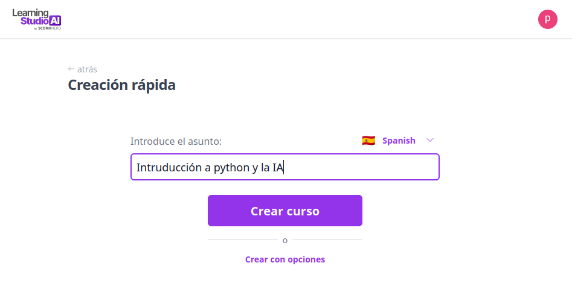


Una de las características más interesantes es que podemos subir un documento (una presentación por ejemplo) y nos creará un cuestionario, tenemos como ejemplo la siguiente unidad creada a partir de uan presentación que se hizo a las jornade CDD.

[https://h5p-live.nolej.app/documentos/5377afc5-5fc7-4601-81ba-147d293694df/previews/ibook/index.html](https://h5p-live.nolej.app/documentos/5377afc5-5fc7-4601-81ba-147d293694df/previews/ibook/index.html)

Una herramienta alternativa es la siguiente: [LearningStudioAI](https://learningstudioai.com/) para generar automáticamente preguntas de opción múltiple, de discusión abiertas o «interpretativas» y de debates con las respuestas correspondientes, a partir de documentos adjuntados.

## Schemely

[Schemely](https://schemely.app/) es una plataforma de creación de cursos para profesores, con AI generativa. Es bastante completa y nos permite enlazar la planificación generada con otras herramientas para crear materiales  adicionales.

:::info
Cuando nos pide el título del curso pensáis que estáis realizando lo prompt al modelo, por lo tanto podéis ser detallistas al respeto.
:::


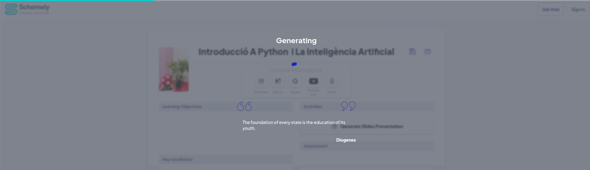


## TutorAI

[TutorAI](https://www.tutorai.me/) es una aplicación pensada para el autoaprendizaje. Le exponemos un tema y nos dará diferentes módulos para poder aprender.


## MagicSchoolAi

[MagicSchoolAi](https://www.magicschool.ai/) es un conjunto de herramientas agrupadas que nos permite crear materiales por el aula. Una opción interesante es la de crear un cuestionario a partir de una temática.

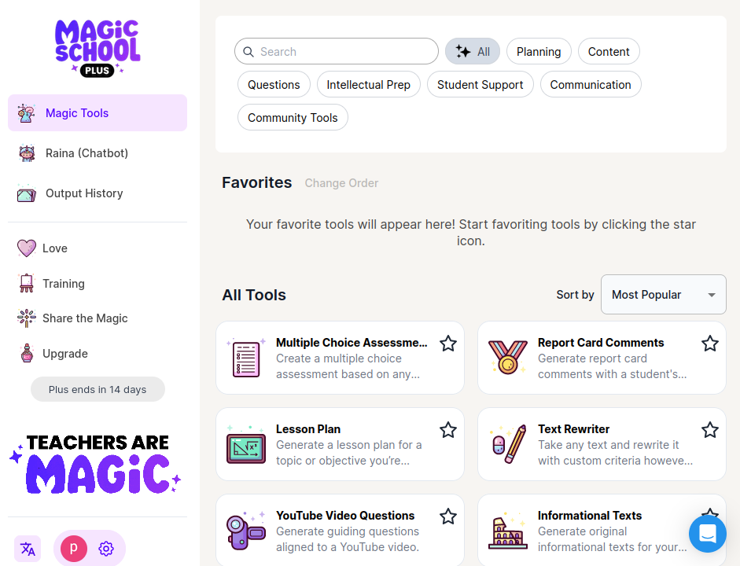


:::note
Al igual que las otras nos da un periode gratuito de muestra. Pero posteriormente a pesar de que no se podan utlitzar todas las herramientas, las que puedes utilizado son de gran utilidad.
:::

## Otras herramientas

Existen multitudes de herramientas. Pero todas ellas semblantes para crear materiales. Os propossem que dais un vistazo a otras herramientas como:

### Quizgecko

[Quizgecko](https://quizgecko.com/ ) es una plataforma de creación de cuestionarios en linea que ayuda los usuarios a crear cuestionarios interactivos y atractivos para sus estudiantes.

### Quillionz

[Quillionz](https://app.quillionz.com/) es una herramienta que utiliza inteligencia artificial para generar automáticamente preguntas de opción múltiple, de discusión abiertas o «interpretativas» y de debates con las respuestas correspondientes, a partir de documentos adjuntados. La herramienta es totalmente gratuita, a pesar de que tiene tres cuentas por elección propia que son Premium, de pago, con más funcions1

### GitMind

[GitMind](https://gitmind.com/es/) es una aplicación gratuita de mapas mentales y lluvia de ideas.

# Otras herramientas interesantes

## ChatPDF

Personalmente [ChaPDF](https://www.chatpdf.com) es una de las aplciacions que más me gusta. En este caso se puede subir un PDF y "hablar" con él, puedes hacerle preguntas diversas. En este caso hemos subido la normativa de cursos. Las respuestas que mujer no son 100% correctos pero te puede dar una idea y, el mejor, es que te enlaza a la respuesta a la parte del documento donde se hablar de ese tema:


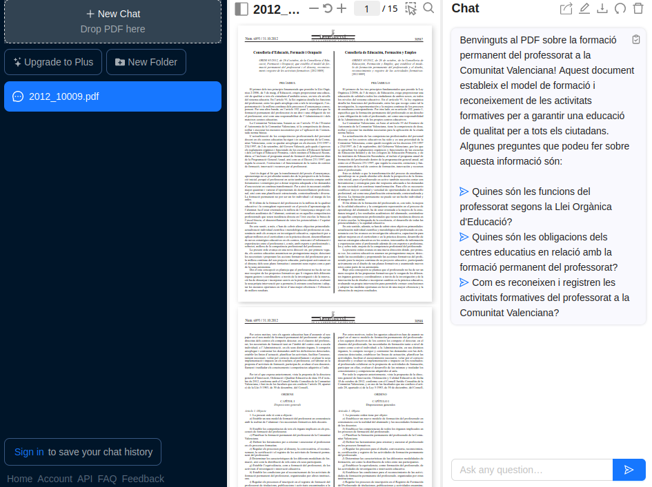

## Geospy

[Geospy](https://geospy.web.app/) es una herramienta que nos permite conocer el lugar de dónde es la imagen. Es muy interesante porque te hace un razonamiento de porque cree que es ese lugar u otro. Muchos pensaréis que utiliza las metadates para saberlo pero dados los razonamiento te hacen dudar. Los resultados suelen ser bastante certers, pero al ejemplo podemos ver que no siempre es fiable (se trata de una fotografía de la superficie de la luna):


## GPT4All

[GPT4All](https://gpt4all.io/index.html) nos permite tener un modelo GPT a nuestro ordenador, eso sí, no esperáis tener un rendimiento como el que tenéis a la plataforma de ChatGPT, puesto que nuestros ordenadores no son ni de lejos como el que utilizan las plataformas.

# Y si no encuentro el que busco.

Aquí hemos tratado de exponeros varias herramientas que utilizan la IA,  han muchísimas y cada vez  existen más y más. Exisiteix una página que va recopilando todas y cada una de ellas. Si no encuentras el que buscas o buscas alguna alternativa se puede visitar la siguiente página. Siempre habrá alguna que se adapte al que estás buscando.

https://theresanaiforthat.com/

Hace falta que tener en cuenta que el gran boom de la inteligencia artificial fue al 2022, cada vez irán existiendo mejores herramientas y más accesibles, más económicas o incluso más gratuitas. Estas propuestas que os platengem es por que veáis que es el que nos espera en los próximos años y vais acostumbrándoos a utiltizar este tipo de herramientas y las vayáis implementando dentro de vuestra Aula. Solo hace falta que pensáis como estavem con el móviles hace 10 años y como de caras eras las gritadas...

Os dejamos para finalizar esta unidad una frase extraída de un artículo que hay que #plantear:

> “Chat GPT supone una amenaza para el profesorado más anquilosado del sistema, que todavía se cree que monopoliza las fuentes del conocimiento y que siempre se inseguro de su autoridad docente. Miedo eso, su primera reacción se prohibirlo en lugar de integrarlo en el aprendizaje como una herramienta más. De la misma manera que se necesario alfabetizar al alumnado  lo uso crítico de internet , de Google, del móvil o del ecosistema audiovisual, habrá que trabajar en el aula cono Chat GPT y plantear cómo ir más allá de sus respuestas, qué hacer y cómo identificar sus sesgos y su superficialidad.”
Javier Palazón[^3]

[^3]: https://www.eldebate.com/educacion/20230415/chatgpt-educacion-enemigo-aliado-profesores_106508.html