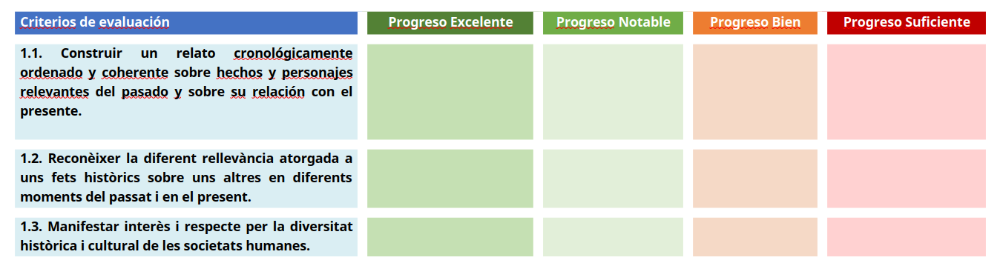

---
# Informació general del document
title: 5. Creació de situacions d'aprenentatge
lang: ca
page-background: img/bg.png
linkcolor: blue


# Portada
titlepage: true
titlepage-rule-height: 2
titlepage-rule-color: AA0000
titlepage-text-color: AA0000
titlepage-background: U5.png

# Taula de continguts
toc: true
toc-own-page: true
toc-title: Continguts

# Capçaleres i peus
header-left: 5. Creació de situacions d'aprenentatge
header-right: Curs 2023-2024
footer-left: CEFIRE València
footer-right: \thepage/\pageref{LastPage}

# Imatges
float-placement-figure: H
caption-justification: centering

# Llistats de codi
listings-no-page-break: true
listings-disable-line-numbers: false

header-includes:
- |
  ```{=latex}
  \usepackage{lastpage}
  \usepackage{awesomebox}
  \usepackage{caption}
  \usepackage{array}
  \usepackage{tabularx}
  \usepackage{ragged2e}
  \usepackage{multirow}
  \usepackage{xcolor}

  ```
pandoc-latex-environment:
  noteblock: [note]
  tipblock: [tip]
  warningblock: [warning]
  cautionblock: [caution]
  importantblock: [important]
...

<!-- \awesomebox[violet]{2pt}{\faRocket}{violet}{Lorem ipsum…} -->

<!-- \awesomebox[violet]{2pt}{\faRobot}{violet}{Lorem ipsum…} -->

<!-- IMATGE  -->

<!-- \textbf{greatest} -->

<!-- \awesomebox[violet]{2pt}{\faRobot}{violet}{\textbf{greatest}} -->

\vspace{\fill}


{ height=50px }

Aquest document està subjecte a una llicència creative commons que permet la seua difusió i ús comercial reconeixent sempre l'autoria del seu creador. Aquest document es troba per a ser modificat al següent repositori de github:
<!-- CANVIAR L'ENLLAÇ -->
[https://github.com/arvicenteboix/AIcurscefire](https://github.com/arvicenteboix/AIcurscefire)
\newpage

# SA amb IA

En aquest bloc explicarem com dissenyar una Situació d'Aprenentatge (SA) utilitzant Intel·ligència Artificial (IA). La idea és anar omplint la plantilla de SA que ens proporciona Conselleria amb uns pocs prompts. Potser la primera vegada que ho facis et costarà una mica, però veuràs que, amb la pràctica, en uns minuts pots crear una situació d'aprenentatge en pocs passos. Òbviament, el paper fonamental de la IA és oferir-te inspiració perquè tu seleccionis i modifiquis els resultats que et doni. No recomanem volcar els resultats que ens ofereixi la IA tal qual, sinó que, mitjançant el diàleg amb ella, obtinguem resultats cada vegada més precisos i coherents.

Abans de començar necessitem tenir a mà dos documents:

-   La plantilla de situació d'aprenentatge. Descarrega-la aquí: [Plantilla SA](https://portal.edu.gva.es/formaciodelprofessorat/es/2-situaciones-de-aprendizaje-en-marcha/).

-   El currículum oficial del qual extreurem les competències específiques, els criteris d'avaluació i sabers bàsics. El pots trobar fàcilment a [noucurrículum.es](https://portal.edu.gva.es/noucurriculum/)

A continuació, explicarem pas a pas el procés de creació d'una SA mitjançant IA:

##  Assignar un rol a la IA:

És fonamental crear bons prompts (instruccions) per obtenir els millors resultats possibles. Però igual de important és demanar-li a la IA que adopte un rol determinat des del qual ens pugui donar la millor informació possible. Per això el primer que farem és demanar-li que es converteixi en una experta en el disseny de SA. T'oferim un exemple de prompt per assignar el rol, en el qual només hauràs de canviar el que estiga subratllat per adaptar-lo a les teues necessitats:

\awesomebox[violet]{2pt}{\faRobot}{violet}{\textbf{Actua com una experta en el disseny de Situacions d'Aprenentatge (LOMLOE) per al primer curs d'Educació Secundària Obligatòria. Tens un ampli coneixement en Metodologies innovadores, Aprenentatge Basat en Projectes i inclusió, i estàs familiaritzada amb una gran varietat de bibliografia al respecte que utilitzes per a donar assessorament a altres professors. Si tens alguna pregunta o inquietud relacionada amb el tema que et plantege, t'anime a compartir-la amb mi. Si hi ha algun tema del qual no tingues coneixement, prefereix que evites improvisar; sigues honesta i notifica'm si no has comprés alguna cosa. M'agradaria que utilitzes un llenguatge clar i formal, i que les teues idees siguen creatives i apropiades per a la situació educativa que et sol·licitaré a continuació. M'he explicat correctament?}}

##  Seguir la plantilla de SA:

Per poder crear un bon prompt, que ens oferisca una resposta el més
personalitzada possible, hi ha apartats de la plantilla que hem d'omplir nosaltres mateixos. Es tracta de tota la primera fila de la taula. També hem d' emplenar la informació de context: On està ubicat el centre, nivell socioeconòmic de les famílies de l' alumnat, de l' entorn incloent les característiques de l' alumnat, necessitats
específiques, problemàtica concreta, etc. Finalment, hem d'indicar a la plantilla, el mateix prompte quines competències específiques, criteris d'avaluació i sabers bàsics volem treballar. Per això ens hem d'ajudar del currículum oficial, tallant pegant. Aquí tens un exemple en què has de substituir el text subratllat pel teu personalitzat.

\awesomebox[violet]{2pt}{\faRobot}{violet}{\textbf{Crea l'estructura d'una Situació d'Aprenentatge per a la matèria de Geografia i història, de 1r d'ESO, que es desenvoluparà en el següent context: \_\_.}}

\awesomebox[violet]{2pt}{\faRobot}{violet}{\textbf{Ha de treballar aquestes competències bàsiques: \_\_.}}

\awesomebox[violet]{2pt}{\faRobot}{violet}{\textbf{Ha de treballar aquests criteris d'avaluació: \_\_.}}

\awesomebox[violet]{2pt}{\faRobot}{violet}{\textbf{Ha de treballar aquests sabers bàsics: \_\_.}}

\awesomebox[violet]{2pt}{\faRobot}{violet}{\textbf{Indica'm el títol de la Situació d'Aprenentatge, la descripció, la justificació i el producte final que haurà d'elaborar l'alumnat en grups per a resoldre el desafiament plantejat. Intenta que siga molt atractiu per a l'alumnat i que estiga molt vinculat a la resolució d'un problema real, proper i útil.}}

A partir d'ací enganxa on corresponga la resposta de la IA. Si no et sembla correcta o millorable indíques-ho: "Genera una resposta nova", "Repeteix-ho donant més importància al context que t'he indicat".

##  Prompt seqüència didàctica:

A continuació podem demanar-li a la IA que genere les activitats i la temporalització de les mateixes.

\awesomebox[violet]{2pt}{\faRobot}{violet}{\textbf{Desenvolupa les activitats que composaran la Situació d'Aprenentatge. Indica el nombre de sessions de la situació d'aprenentatge, el nombre d'activitats per sessió i la descripció de l'activitat. Tingues en compte que cada sessió és de 55 minuts. Finalment indica la data de fi, sabent que vull començar \_\_ i que dedique \_\_ sessions en la setmana.}}

Si en la seqüència didàctica no apareixen desenvolupades les activitats, demana-li que ho faci si així ho desitges:

\awesomebox[violet]{2pt}{\faRobot}{violet}{\textbf{Desenvolupa Sessió 1/Activitat 1 i indica en forma de cronograma com es desenvoluparia.}}

##  Prompt d'avaluació:

Arribats a aquest punt podem intentar que la IA ens faça una proposta en relació a l'avaluació. Podem demanar-li que ens indique quins instruments d'avaluació proposa per a registrar cada criteri.

\awesomebox[violet]{2pt}{\faRobot}{violet}{\textbf{Crea una taula amb dues columnes: criteri d'avaluació i instrument d'avaluació (observació directa, llista de comprovació, rúbrica, diana d'avaluació, exit ticket...). Ompli-la amb els criteris d'avaluació que t'he indicat i l'instrument d'avaluació que consideres més apropiat en cada cas.}}

Inclús pots demanar-li que desenvolupe o cree aquests instruments d'avaluació:

\awesomebox[violet]{2pt}{\faRobot}{violet}{\textbf{Desenvolupa la llista de comprovació que has proposat per avaluar el criteri \_\_\_ en l'activitat \_\_\_.}}

\awesomebox[violet]{2pt}{\faRobot}{violet}{\textbf{Desenvolupa la rúbrica de la tasca \_\_\_ en forma de taula de doble entrada en la qual cada fila és un ítem en el qual es relaciona el criteri d'avaluació amb els sabers bàsics i cada columna el grau de consecució de cada ítem.}}

Si en aquest apartat, els resultats que t'ofereix la IA no et convençen, et proposem una altra forma d'utilitzar-la per a facilitar el procés d'avaluació. Com en una situació d'aprenentatge, de què es tracta és d'avaluar el progrés en el grau d'adquisició de les competències específiques, prenent com a referent els criteris d'avaluació, t'ajudem a mostrar-ho en forma de rúbrica.

Crea una taula similar a aquesta, en la qual substituïsquem la competència específica, i els seus respectius criteris d'avaluació, pels que a tu t'interessen:

\awesomebox[violet]{2pt}{\faRobot}{violet}{\textbf{CE 1. Descriure i contextualitzar en el temps i l'espai els esdeveniments i els processos més rellevants de la història pròpia i universal, identificant referents de l'evolució cap a la societat actual i valorant la diversitat.}}



Ara demana-li a la IA que mostre en progressió els diferents graus d'adquisició de cada criteri:

\awesomebox[violet]{2pt}{\faRobot}{violet}{\textbf{Desglossa el següent criteri: "Construir un relat cronològicament ordenat i coherent sobre fets i personatges rellevants del passat i sobre la seua relació amb el present", en cinc nivells d'acompliment.}}

##  Prompt atenció a la diversitat:

Finalment, pots demanar-li a la IA que faça una proposta sobre les mesures de resposta per a la inclusió. Encara que potser en aquest apartat és on el factor humà és més important, per tant, després de la resposta de la IA, aplica el sentit comú i els teus coneixements sobre el DUA-A, que pots ampliar a través d'aquests recursos: [DUA-a](https://portal.edu.gva.es/cefireinclusiva/es/dua-a-2/)

\awesomebox[violet]{2pt}{\faRobot}{violet}{\textbf{Desenvolupa les Mesures de resposta per a la inclusió (DUA), metodologies inclusives, Organització d'espais d'aprenentatge, Recursos i Materials, tenint en compte a l'alumnat que té les següents necessitats especials.}}

Esperem que aquesta guia t'haja resultat útil, i que t'haja servit d'ajuda en el disseny de les teues situacions d'aprenentatge. No oblides que l'ajuda ve de les idees inspiradores que aporta, però que convé filtrar i seleccionar, en funció dels nostres coneixements i interessos.